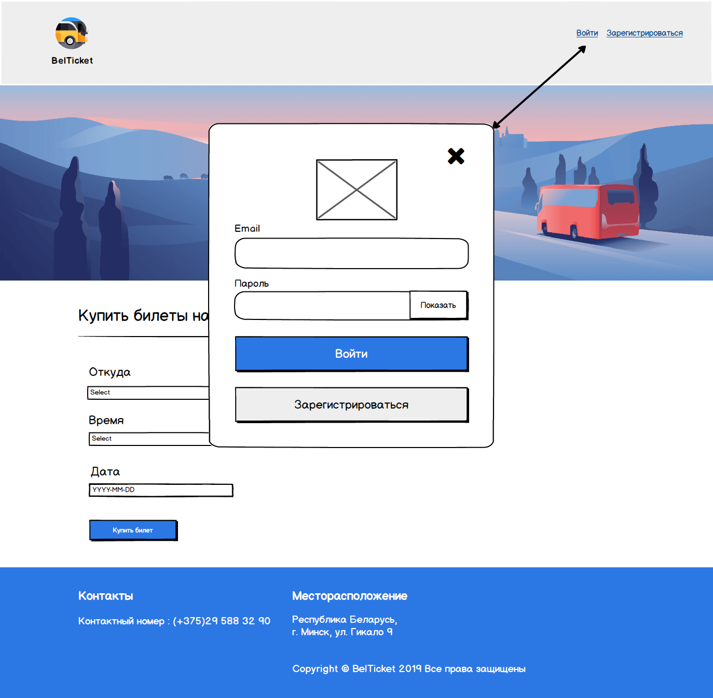
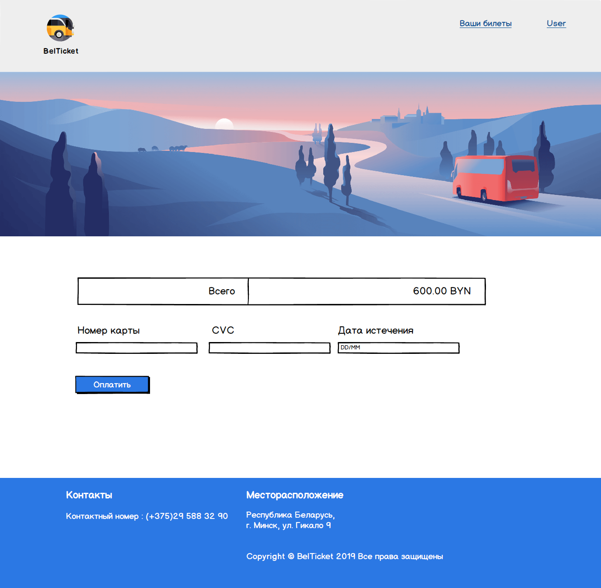
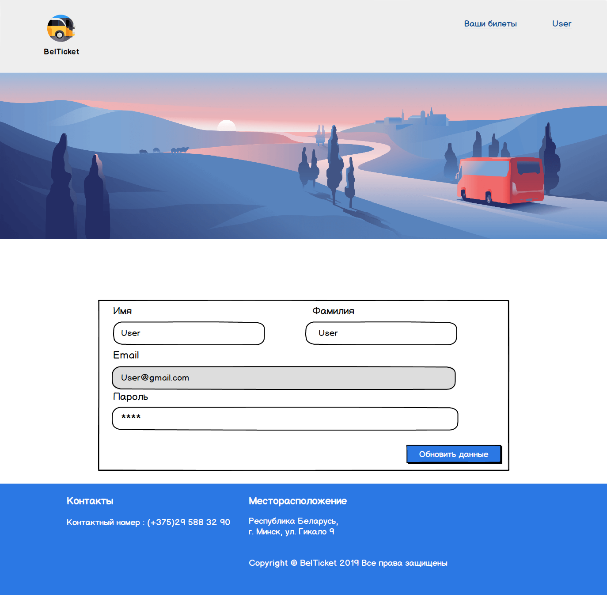
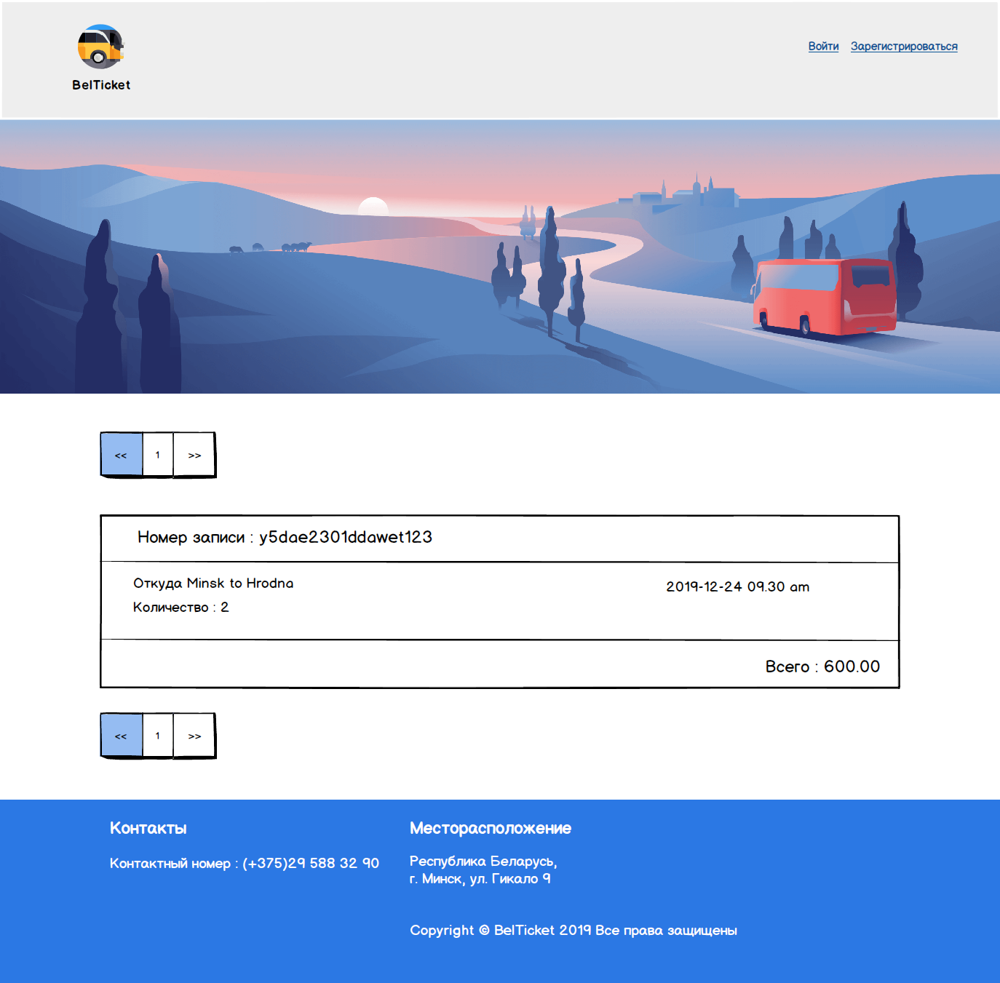

# Требования к проекту
---

# Содержание
1 [Введение](#intro)  
1.1 [Назначение](#appointment)  
1.2 [Бизнес-требования](#business_requirements)  
1.2.1 [Исходные данные](#initial_data)  
1.2.2 [Возможности бизнеса](#business_opportunities)  
1.2.3 [Границы проекта](#project_boundary)  
1.2.4 [Предположения и зависимости](#assumptions_and_dependencies)  
1.3 [Аналоги](#analogues)  
2 [Требования пользователя](#user_requirements)  
2.1 [Программные интерфейсы](#software_interfaces)  
2.2 [Интерфейс пользователя](#user_interface)  
2.3 [Характеристики пользователей](#user_specifications)  
2.3.1 [Классы пользователей](#user_classes)  
2.3.2 [Аудитория приложения](#application_audience)    
3 [Системные требования](#system_requirements)  
3.1 [Функциональные требования](#functional_requirements)  
3.1.1 [Вход пользователя на сайт](#user_logon_to_the_site)  
3.1.2 [Настройка аккаунта активного пользователя](#setting_up_the_account_of_the_active_user)  
3.1.3 [Просмотр приобретенных билетов](#purchased_tickets)  
3.1.4 [Выход пользователя из учётной записи](#active_user_change)   
3.1.5 [Покупка билетов](#purchase)  
3.2 [Нефункциональные требования](#non-functional_requirements)  
3.2.1 [Атрибуты качества](#quality_attributes)  
3.2.1.1 [Требования к удобству использования](#requirements_for_ease_of_use)  
3.2.1.2 [Требования к безопасности](#security_requirements)  
3.2.2 [Внешние интерфейсы](#external_interfaces)  
3.2.3 [Ограничения](#restrictions)

# Глоссарий

* Анонимный пользователь — посетитель сайта, не прошедший процедуру авторизации.
* База данных - коллекция всей информации, отслеживаемой этой системой.

<a name="intro"/>

# 1 Введение

<a name="appointment"/>

## 1.1 Назначение
Данный документ описывает функциональные и нефункциональные требования к веб-приложению «BelTicket» и используется как средство коммуникации между различными заинтересованными лицами.

<a name="business_requirements"/>

## 1.2 Бизнес-требования

<a name="initial_data"/>

### 1.2.1 Исходные данные
Использование транспорта, такого как автобус, всегда пользуется спросом у большой части населения Беларуси. Использование данного вида транспорта увеличивается, особенно в сезон праздников и школьных каникул, и это привело к тому, что жители Беларуси, особенно те, кто живет в крупных городах, часто сталкиваются с проблемами, чтобы получить билет на автобус. Современные технологии, быстрота в повседневной жизни делают большой упор на сглаживание планирования времени.

<a name="business_opportunities"/>

### 1.2.2 Возможности бизнеса
Веб-сайт «BelTicket» с продажей автобусных билетов призван упростить и ускорить процесс покупки автобусного билета.

<a name="project_boundary"/>

### 1.2.3 Границы проекта
Веб-приложение «BelTicket» позволит зарегистрированным пользователям приобретать билеты для поездок на автобусе и возможность просматривать информацию об уже приобретенных билетах.

<a name="asssumptions_and_dependencies"/>

### 1.2.4 Предположения и зависимости
Приложение не работает при отсутствии подключения к Интернету.

<a name="analogues"/>

## 1.3 Аналоги
* [ticketbus.by](https://ticketbus.by/)  
  Основной недостаток заключается в неудобном пользовательском интерфейсе.  
  Достоинства:
  * Наличие расписания с автовокзалов.
  * Большое количество справочной информации.

* [ecolines.by](https://ecolines.by/by/ru)
  * Имеется карта маршрутов.
  * Дополнительное бронирование гостиницы.

<a name="user_requirements"/>

# 2 Требования пользователя

<a name="software_interfaces"/>

## 2.1 Программные интерфейсы
На серверной части веб-приложения будет создано REST API на Node.js.
<a name="user_interface"/>

## 2.2 Интерфейс пользователя
Главная страница веб-сайта.  
  
Главная страница с окном регистрации нового пользователя.  
  
Главная страница с окном входа пользователя.  

Главная страница веб-сайта (зарегистрированный пользователь).  
.png)
Cтраница веб-сайта с покупкой билета.  
  
Страница с данными пользователя.  

Страница с приобретенными билетами.

<a name="user_specifications"/>

## 2.3 Характеристики пользователей

<a name="user_classes"/>

### 2.3.1 Классы пользователей

| Класс пользователей | Описание |
|:---|:---|
| Анонимные пользователи | Пользователи, которые не хотят регистрироваться на сайте. Имеют доступ к авторизации и регистрации |
| Зарегистрированные пользователи | Пользователи, которые вошли на сайт под своим email и хотят приобретать билеты. Имеют доступ к полному функционалу |

<a name="application_audience"/>

### 2.3.2 Аудитория приложения 

Люди со средним или выше среднего уровнем образования, обладающие минимальной технической грамотностью.

<a name="system_requirements"/>

# 3 Системные требования

<a name="functional_requirements"/>

## 3.1 Функциональные требования

<a name="user_logon_to_the_site"/>

#### 3.1.1 Вход пользователя на сайт
**Описание.** Пользователь имеет возможность использовать сайт без создания собственного профиля либо войдя в свою учётную запись.

| Функция | Требования | 
|:---|:---|
| Регистрация нового пользователя | Веб-приложение должно запросить у пользователя ввести имя, фамилию, электронную почту и пароль для создания учётной записи. Пользователь должен либо ввести данные, либо отменить действие |
| Пользователь с такой электронной почтой уже существует | Приложение должно известить пользователя об ошибке регистрации. Пользователь должен либо ввести другую электронную почту, либо отменить действие |
| Вход зарегистрированного пользователя в приложение | Приложение должно предоставить пользователю ввод электронной почты и пароля. Пользователь должен либо ввести данные, либо отменить действие |

<a name="setting_up_the_account_of_the_active_user"/>

#### 3.1.2 Настройка аккаунта активного пользователя
**Описание.** Зарегистрированный пользователь имеет возможность просматривать и редактировать свои данные.
 
**Требование.** Приложение должно предоставить зарегистрированному пользователю просматривать свои данные и редактировать их. Пользователь должен либо редактировать их и сохранить изменения, либо отменить действие, т.е. не нажимать на кнопку сохранения.

<a name="purchased_tickets"/>

#### 3.1.3 Просмотр приобретенных билетов

**Требование.** Веб-приложение должно предоставить зарегистрированному пользователю возможность просмотра списка приобретенных билетов.

<a name="active_user_change"/>

#### 3.1.4 Выход зарегистрированного пользователя из учётной записи

**Требование.** Веб-приложение должно предоставить зарегистрированному пользователю возможность выйти из учётной записи с возвратом на главную страницу веб-сайта.

<a name="purchase"/>

#### 3.1.5 Покупка билетов

**Требование.** Веб-приложение должно предоставить зарегистрированному пользователю интерфейс покупки билета на автобус, т.е. возможность выбрать место отправления, назначения, время и дату поездки, при оплате указать номер платежной карты, вывести итоговою сумму за билет/билеты и оплатить заказ.

<a name="non-functional_requirements"/>

## 3.2 Нефункциональные требования

<a name="quality_attributes"/>

### 3.2.1 Атрибуты качества

<a name="requirements_for_ease_of_use"/>

#### 3.2.1.1 Требования к удобству использования
1. Доступ к основным функциям приложения не более чем за две операции.
2. Все функциональные элементы пользовательского интерфейса имеют названия либо интуитивно указывают на действие, которое произойдет при выборе элемента.

<a name="security_requirements"/>

#### 3.2.1.2 Требования к безопасности
На сервере будет установлен брандмауэр, чтобы можно было фильтровать входящие транзакции. Целостность данных для критических переменных также будет проверена. Веб-приложение хранит данные пользователей в базе данных и имеет к ней исключительный доступ.

<a name="external_interfaces"/>

### 3.2.2 Внешние интерфейсы
Страницы веб-сайта имеют приятный дизайн и благотворно влияют на психологическое состояние и выбор пользователя:
  * функциональные элементы контрастны фону страницы и своим дизайном интуитивно указывают на действие, совершаемое ими.
  * элементы веб-страниц гармонично сочетаются между собой.
<a name="restrictions"/>

### 3.2.3 Ограничения
Профили пользователей, информация о доступных билетах хранятся в локальной базе данных.
