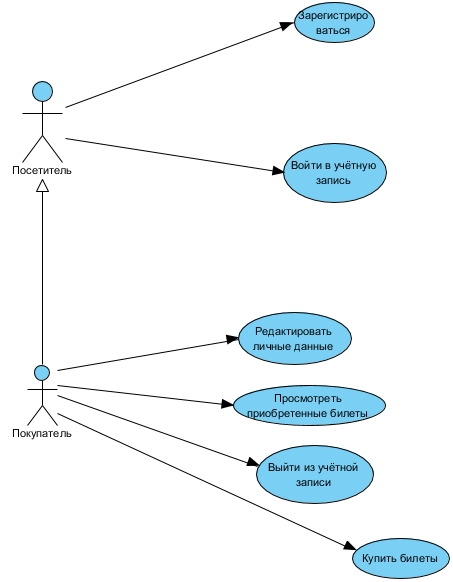
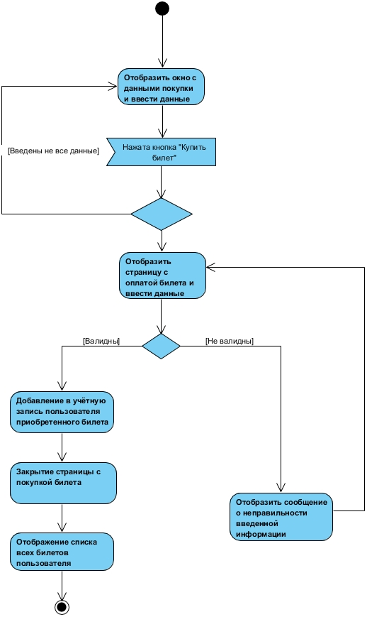
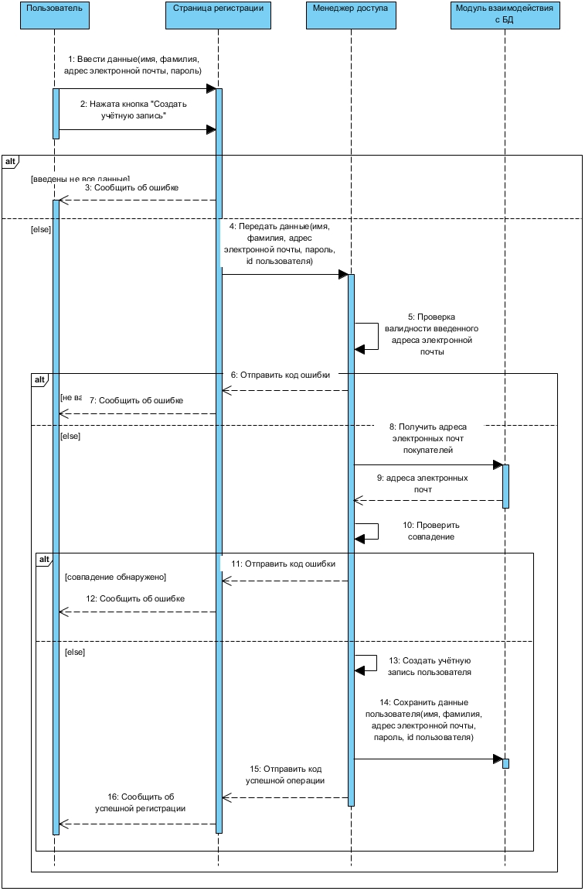
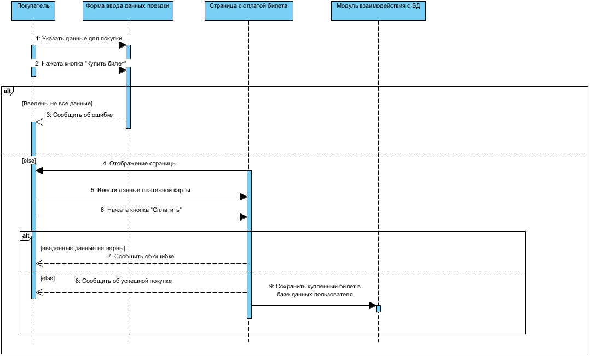
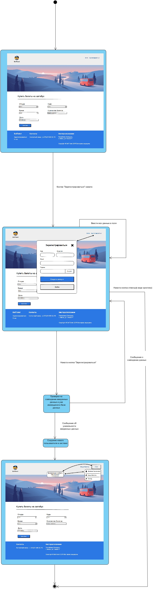
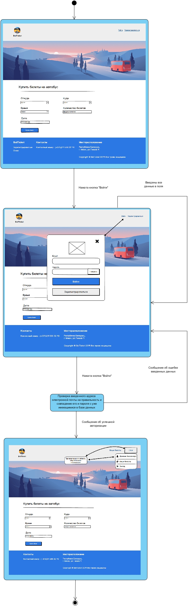
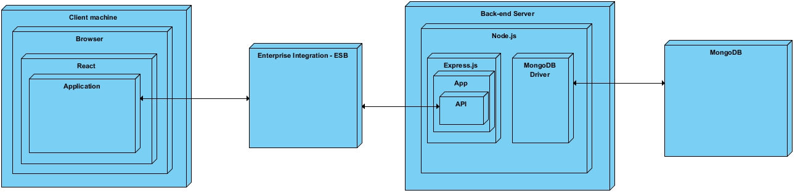

# UML Диаграммы

# Содержание
1. [Диаграмма вариантов использования](#use_case_diagram)  
   1.1 [Актёры](#actors)  
   1.2 [Варианты использования](#use_cases)  
   1.2.1 [Зарегистрировать](#registration)  
   1.2.2 [Войти в учётную запись](#sign_in)  
   1.2.3 [Редактировать личные данные](#edit_user_data)  
   1.2.4 [Просмотреть приобретенные билеты](#view_purchased_tickets)  
   1.2.5 [Выйти из учётной записи](#sign_out)  
   1.2.6 [Купить билеты](#buy_tickets)  
2. [Диаграммы активностей](#activities_diagrams)  
   2.1 [Зарегистрировать](#registration_activity)  
   2.2 [Войти в учётную запись](#sign_in_activity)   
   2.3 [Купить билеты](#buy_tickets_activity)  
3. [Диаграммы последовательностей](#sequence_diagrams)  
   3.1 [Зарегистрировать](#registration_sequence)  
   3.2 [Войти в учётную запись](#sign_in_sequence)    
   3.3 [Купить билеты](#buy_tickets_sequence)  
4. [Диаграммы состояний](#state_diagrams)  
   4.1 [Зарегистрировать](#registration_state)  
   4.2 [Войти в учётную запись](#sign_in_state)  
   4.3 [Купить билеты](#buy_tickets_state)  
5. [Диаграмма классов](#class_diagram)  
6. [Диаграмма компонентов](#component_diagram)  
7. [Диаграмма развёртывания](#deployment_diagram)  
<a name="use_case_diagram"/>

# 1. Диаграмма вариантов использования
  

<a name="actors"/>

## 1.1 Актёры
| Актёр | Описание | 
|:---|:---|
| Посетитель | Человек, который зашёл на сайт и не авторизовался в системе. Имеет ограниченный набор действий на сайте.|
| Покупатель | Человек, который авторизовался в системе и имеет доступ ко всему функционалу сайта.|

<a name="use_cases"/>

## 1.2 Варианты использования

<a name ="registration"/>

### 1.2.1 Зарегистрировать
**Описание.** Вариант использования "Зарегистрироваться" позволяет посетителю создать свою учётную запись на сайте.  
**Основной поток.**
1. Пользователь нажимает на кнопку "Зарегистрироваться" на главной странице сайта в верхнем правом углу.
2. На сайте отображается окно регистрации, в котором запрашивается ввод имени, фамилии, адреса электронной почты и пароля.
3. Пользователь вводит имя, фамилию, адрес электронной почты и пароль.
4. Пользователь нажимает на кнопку "Создать аккаунт".
5. Веб-приложение проверяет адрес электронной почты на совпадение с другими, на которые зарегистрированы другие пользователи. Если совпадение нашлось, тогда сайт отобразит уведомление об этом и выполнение основного потока переходит к пункту 3.
6. Веб-сайт уведомляет об успешной регистрации и скрывает окно регистрации.
7. Веб-приложение добавляет в базу данных нового пользователя.
8. Завершение варианта использования.

**Дополнительная информация.** Пользователь имеет возможность отменить действие до нажатия на кнопку создания учётной записи. В случае отмены выполняется альтернативный поток А1.

**Альтернативный поток А1.**  
1.Веб-сайт скрывает окно регистрации.  
2.Завершение варианта использования.

<a name ="sign_in"/>

### 1.2.2 Войти в учётную запись
**Описание.** Вариант использования "Войти в учётную запись" позволяет посетителю войти в учётную запись.  
**Основной поток.**
1. Пользователь нажимает на кнопку "Войти" на главной странице веб-сайта.
2. Веб-сайт отображает окно "Войти", в котором запрашивается ввод адреса электронной почты и пароля.
3. Пользователь вводит адрес электронной почты и пароль.
4. Пользователь нажимает на кнопку "Войти".
5. Веб-сайт проверяет на наличие адреса электронной почты в базе данных зарегистрированных пользователей в системе и соответствие введеннных адреса электронной почты и пароля. Если такого адреса электронной почты не существует или соответствия адреса электронной почты и пароля, тогда выполнение основного потока переходит к пункту 3.
6. Веб-сайт скрывает окно "Войти" и отображает главную страницу, соответствующую покупателю.
7. Завершение варианта использования.

**Дополнительная информация.** Пользователь имеет возможность отменить действие до нажатия на кнопку входа. В случае отмены выполняется альтернативный поток А1.

**Альтернативный поток А1.**  
1.Веб-сайт скрывает окно входа.  
2.Завершение варианта использования.

<a name ="edit_user_data"/>

### 1.2.3 Редактировать личные данные
**Описание.** Вариант использования "Редактировать личные данные" позволяет покупателю просматривать и изменять данные своей учётной записи.  
**Основной поток.**
1. Пользователь нажимает на область с его именем в верхнем правом углу сайта.
2. Веб-приложение отображает список действий, в котором имеется кнопка "Данные пассажира".
3. Пользователь нажимает на данную кнопку.
4. Веб-приложение отображает страницу с данными пользователя, в котором можно редактировать такие данные как: имя, фамилия и пароль.Ы
5. Пользователь редактирует некоторые данные.
6. Пользователь нажимает на кнопку "Обновить данные"
7. Веб-приложение сохраняет измененные данные в базе данных.
8. Завершение варианта использования.

**Дополнительная информация.** Пользователь имеет возможность отменить действие до нажатия на кнопку "Обновить данные".

<a name ="view_purchased_tickets"/>

### 1.2.4 Просмотреть приобретенные билеты
**Описание.** Вариант использования "Просмотреть приобретенные билеты" позволяет покупателю просмотреть список приобретенных билетов.  
**Основной поток.**
1. Пользователь нажимает на кнопку "Ваши билеты" на главной странице веб-сайта возле имени пользователя и выполнение основного потока переходит к пункту 4 либо пользователь нажимает на область с именем пользователя.
2. Веб-приложение отображает список действий, в котором имеется кнопка "Ваши билеты".
3. Пользователь нажимает на данную кнопку.
4. Веб-приложение отображает страницу со списком купленных билетов пользователем.
5. Завершение варианта использования.

<a name ="sign_out"/>

### 1.2.5 Выйти из учётной записи
**Описание.** Вариант использования "Выйти из учётной записи" позволяет покупателю выйти из своей учётной записи.  
**Основной поток.**
1. Пользователь нажимает на область со значком пользователя и с его именем.
2. Веб-приложение отображает список действий, в котором имеется кнопка "Выход".
3. Пользователь нажимает на данную кнопку.
4. Веб-сайт отображает главную страницу соответствующую посетителю.
5. Завершение варианта использования.

<a name ="buy_tickets"/>

### 1.2.6 Купить билеты
**Описание.** Вариант использования "Купить билеты" позволяет покупателю приобрести билет для поездки на автобусе.  
**Основной поток.**
1. На главной странице веб-сайта(страница с покупкой билета) пользователь выбирает место отправления, место назначения, время, дату поездки и вводит количество билетов.
2. Пользователь нажимает на кнопку "Купить билет".
3. Веб-сайт отображает страницу с оплатой билета.
4. Пользователь вводит данные платёжной карты.
5. Пользователь нажимает на кнопку "Оплатить".
6. Приложение проверяет введённые данные на правильность, если такой платёжной карты в базе данных нет, выполнение основного потока переходит к пункту 4.
7. Веб-приложение сохраняет билет в базе данных и отображает страницу со всеми приобретенными билетами.
8. Завершение варианта использования.

<a name = "activities_diagrams"/>

## 2. Диаграммы активности

<a name = "registration_activity"/>

### 2.1 Зарегистрировать

  

<a name = "sign_in_activity"/>

### 2.2 Войти в учётную запись

  

<a name = "buy_tickets_activity"/>

### 2.3 Купить билеты

<a name = "sequence_diagrams"/>

## 3. Диаграммы последовательностей

<a name = "registration_sequence"/>

### 3.1 Зарегистрировать

  

<a name = "sign_in_sequence"/>

### 3.2 Войти в учётную запись

  

<a name = "buy_tickets_sequence"/>

### 3.3 Купить билеты

<a name = "state_diagrams"/>

## 4. Диаграммы состояний

<a name = "registration_state"/>

### 4.1 Зарегистрировать

  

<a name = "sign_in_state"/>

### 4.2 Войти в учётную запись

  

<a name = "buy_tickets_state"/>

### 4.3 Купить билеты

<a name = "class_diagram"/>

## 5. Диаграмма классов

<a name = "component_diagram"/>

## 6. Диаграмма компонентов

<a name = "deployment_diagram"/>

## 7. Диаграмма развёртывания

